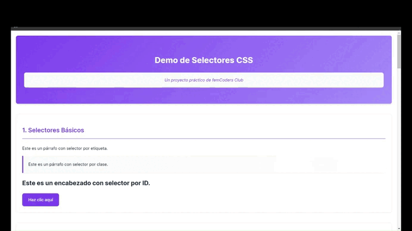

# Domina los Selectores en CSS

Este proyecto, creado por **femCoders Club**, es una demo práctica que acompaña al post [Domina los Selectores en CSS](https://www.femcodersclub.com/recursos/css/selectores-css). Aquí aprenderás a seleccionar elementos del DOM y aplicar estilos de manera precisa, desde selectores básicos hasta avanzados.

## Vista previa



El proyecto incluye ejemplos interactivos y visuales que puedes usar para practicar selectores CSS directamente desde tu navegador.

## Enlaces relevantes

- Repositorio del proyecto: [https://github.com/femcodersclub/CssSelectors](https://github.com/femcodersclub/CssSelectors)
- Demo en vivo: [https://femcodersclub.github.io/CssSelectors/](https://femcodersclub.github.io/CssSelectors/)
- Post Domina los selectores en CSS: [https://www.femcodersclub.com/recursos/css/selectores-css](https://www.femcodersclub.com/recursos/css/selectores-css)

## Contenido

El proyecto incluye las siguientes secciones:

1. **Selectores Básicos**: Aprende a usar selectores por etiqueta, clase e ID.
2. **Selectores Avanzados**: Descubre selectores de atributos, descendientes, hijos directos, hermanos y pseudoclases.
3. **Combinaciones de Selectores**: Combina selectores para estilos más precisos.
4. **Selectores de Tipografía**: Usa selectores como `:first-child`, `:nth-child` y más.
5. **Selectores Estructurales**: Implementa selectores como `:root`, `:not`, `:empty` y más.
6. **Selectores de Interfaz de Usuario**: Personaliza formularios y estados como `:focus` y `:disabled`.
7. **Preprocesadores CSS**: Introducción a Sass y Less con ejemplos de botones reutilizables.

## Funcionalidades destacadas

- **Tema Oscuro**: Cambia entre tema claro y oscuro con un clic.
- **Interacción con Elementos**: Ejemplos dinámicos que responden a eventos como hover y focus.
- **Estilo Moderno**: Diseño limpio y atractivo utilizando variables CSS y transiciones.

## Archivos principales

- `index.html`: Estructura HTML del proyecto.
- `style.css`: Estilos CSS, incluyendo variables y efectos avanzados.
- `index.js`: Lógica interactiva para demostrar selectores y funcionalidad dinámica.
- Carpeta `assets`: Contiene recursos adicionales como el GIF de demostración.

## Ejecución local

1. Clona el repositorio:

```bash
   git clone https://github.com/femcodersclub/CssSelectors.git
   ```

1. Accede al directorio del proyecto:
   ```bash
   cd CssSelectors
   ```
2. Abre el archivo `index.html` en tu navegador favorito.

## Créditos

Este proyecto fue desarrollado por el equipo de **femCoders Club**, una comunidad enfocada en empoderar a mujeres en tecnología.

Si tienes alguna sugerencia o mejora, no dudes en abrir un issue o pull request en el repositorio.

---

¡Esperamos que disfrutes aprendiendo sobre CSS con este proyecto! 🎉

